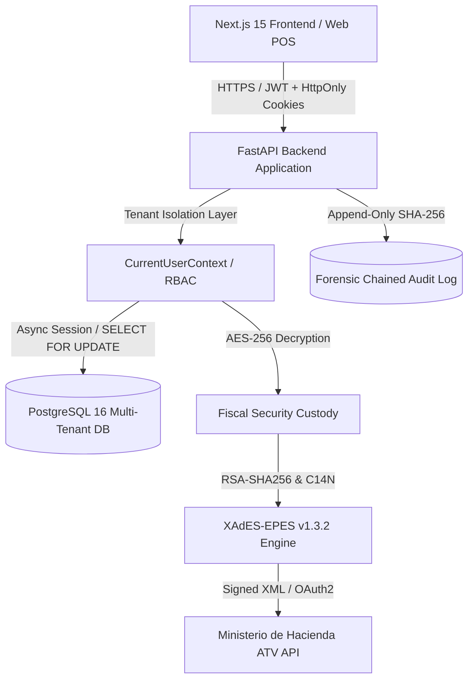

# ORBÍTICA POS — Arquitectura de Producción SaaS Multi-Tenant

## 1. Visión General del Sistema

ORBÍTICA POS es una plataforma de software como servicio (SaaS) multiempresa diseñada para puntos de venta minoristas y comerciales en Costa Rica, con soporte nativo y estricto para Comprobantes Electrónicos v4.4 del Ministerio de Hacienda.

---

## 2. Principios de Arquitectura y Aislamiento Multi-Tenant

### 2.1 Aislamiento a Nivel de Datos (Row-Level Security / Injected Filters)
- **Tenencia Forzada**: Toda entidad transaccional (`Product`, `Sale`, `CashRegister`, `CashRegisterSession`, `ElectronicInvoice`, `ConsecutiveSequence`, `Customer`, `SupportTicket`, etc.) posee una clave foránea no nula `organization_id` indexada.
- **Inyección de Contexto**: La dependencia `get_current_user_context` resuelve el `organization_id` criptográficamente firmado en el Access Token JWT y rechaza cualquier solicitud cruzada con `HTTP 403 Forbidden` o `HTTP 404 Not Found`.
- **Protección contra IDOR**: Todos los endpoints de actualización o lectura validan explícitamente `where(Entity.organization_id == context.organization_id)`.

### 2.2 Atomicidad Transaccional y Control de Concurrencia
- **Consecutivos Fiscales**: La asignación de números de comprobante v4.4 utiliza secuencias atómicas en PostgreSQL con bloqueo pesimista `SELECT ... FOR UPDATE` sobre la tupla `(organization_id, branch_code, terminal_number, doc_type, environment)`, garantizando cero saltos y cero duplicados bajo cargas concurrentes.
- **Inventario Transaccional**: Toda venta bloquea concurrentemente el registro de existencias en `inventory_levels` con `SELECT ... FOR UPDATE`, verificando saldo positivo y bloqueando preventivamente sobreventas con `ConflictException`.
- **Arqueo y Cierre de Caja**: Sesiones de caja con verificación atómica de estado `OPEN` y balance calculado directamente desde la sumatoria de pagos de ventas completadas en el periodo.

---

## 3. Modelo Criptográfico y Facturación Electrónica v4.4

### 3.1 Custodia Segura de Credenciales en Reposo
- Los certificados criptográficos `.p12`, sus contraseñas PIN, y las credenciales del portal ATV de Hacienda nunca se almacenan en texto claro.
- Se utiliza cifrado simétrico robusto **AES-256-CBC con HMAC-SHA256 (Fernet)** mediante una clave maestra administrada por la variable de entorno `FERNET_KEY`.

### 3.2 Motor de Firma Digital XAdES-EPES v1.3.2 Enveloped
- Cumple con la resolución DGT-R-033-2019 y estándar ETSI TS 101 903 v1.3.2.
- **Canonicalización**: Canonical XML 1.0 estándar (`REC-xml-c14n-20010315`).
- **Resumen Criptográfico**: `SHA256` en digests de documento (`SignedProperties`, `KeyInfo`, `Document`).
- **Política de Firma**: Identificador oficial de Hacienda Costa Rica:
  `https://tribunet.hacienda.go.cr/docs/esquemas/2016/v4.2/ResolucionComprobantesElectronicos.pdf`
  con digest hash SHA-256: `security/hacienda-policy.sha256`.

---

## 4. Pila Tecnológica

| Componente | Tecnología | Versión | Rol |
|---|---|---|---|
| **Frontend** | Next.js / React / TypeScript / Tailwind | Next 15, React 19, TS 5.7 | Interfaz de cajero, inventario, administración y Superadmin Hub |
| **Backend** | FastAPI / Python / Pydantic v2 | Python 3.13, FastAPI 0.115 | API REST asíncrona de alto rendimiento |
| **ORM / DB** | SQLAlchemy Async / Alembic / PostgreSQL | SQLAlchemy 2.0, PG 16 | Persistencia relacional, concurrencia transaccional |
| **Criptografía** | Cryptography / lxml / hashlib / Argon2 | cryptography 44+, lxml 5+ | Firma XAdES-EPES, hashing Argon2id, AES-256 |
